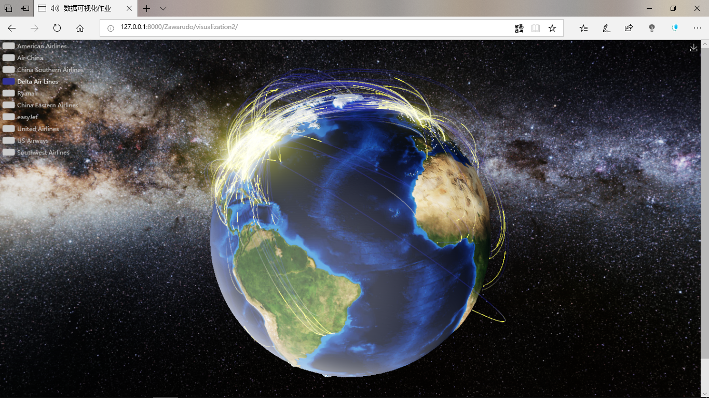
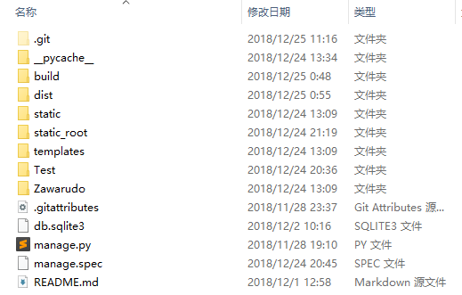

# 飞机航线可视化

## 简介

网站有四个主要界面，home，about，visualization1，visualization2，分别是主页，介绍页面，2d航线可视化页面，3d航线可视化页面。页面直接可以互相链接。

### 主页：

元素：图形滚动框，了解更多按钮链接到visualization2页面，github外链到本项目的github。点击说明可以进入about页面。

### 介绍页面：

元素：动态背景视频，以及介绍性文字段落。

点击飞机航线1进入visualization1页面。

### 2d航线可视化页面： 

插入图片

元素：描述

点击飞机航线2进入visualization2页面。

### 3d航线可视化页面：

元素：页面加载自动播放背景音乐。地球可放大缩小，自由角度旋转，蓝色线条代表航线轨迹，黄色动态线条代表沿航线飞行的飞机。左侧可选择按钮，代表不同的航空公司。

## 使用说明

文件结构如下：

### 途径一：

已经将Django项目打包可执行文件exe。位于dist/manage/manage.exe。在该路径下打开cmd，输入：manage.exe
runserver

### 途径二：

若电脑配置有Django，可以在该路径打开cmd，输入：python manage.py runserver

两种途径，都可以启动服务，之后在浏览器输入<http://127.0.0.1:8000/>，会提示页面不存在，

因为我们将页面放在了<http://127.0.0.1:8000/Zawarudo/>下，所以根据提示输入该网址

继续根据提示输入*http://127.0.0.1:8000/Zawarudo/home/* 即可进入主页面。  
浏览器要求：edge有时候会出现bug，下拉框失灵，chrome比较稳定，推荐chrome打开。

## 代码实现

### 数据介绍：

数据说明

#### 2d飞机航线：

语言：python

具体过程

#### 3d飞机航线（airline2.html）：

语言：JavaScript

说明：由于airline2.html被插入在网站，所以其中静态文件以Django中静态文件方式导入，因此直接打开airline2.html无法显示完整，可通过开打网站查看，或者更改其静态文件引入方式换成正常引入方式即可。

实现：基于百度echartgl，导入飞机航线数据，根据机场数据得到所有机场的经纬度以及索引，根据航线数据按索引找到每条航线的对应的两个机场以及机场对应的经纬度。并按照按照航空公司索引找到航线所属航空公司名字，并按照航空公司分类，添加插件可选择按钮，选择航空公司。根据航线的坐标数据在地球添加航线线line3D和及动态效果，以及机场scatter3D，并定义其参数。添加地球参数，表面图，表面地形突起图，背景图，光线分布图，阴影，自动旋转等。并在\<body\>下以\<audio\>插入背景音乐，实现加载页面时，自动播放背景音乐。

### 网站：

语言：python

基于Django框架，搭建网站结构，首先建立一个Test项目，在settings.py文件中写入配置参数，并设好静态文件路径'/static/'。在urls.py
定义网站的链接网址。新建一个app：Zawarudo。在settings.py中注册。在Zawarudo/views.py中定义视图函数，插入html文件。在Zawarudo/urls.py定义视图调用路径。

#### 网页文件（about2.html，cover.html）：

语言：html、JavaScript

基于bootstrap框架，建立网页外观模板，（除了框架其他都自己实现）之后在此基础上实现自定义功能如下拉框，背景图片，背景视频，文字段落，点击按钮，跳转链接等。

#### 可执行文件：

语言：python

使用pyinstaller，在Django项目所在路径，cmd运行python pyi-makespec -D
manage.py，生成.spec文件。修改spec文件，手动添加Django隐式导入的库；添加Django中的templates以及静态文件（其中一些细节需要在Django项目文件中改动）。更改好之后cmd运行python
pyinstaller manage.spec，生成可执行文件manage.exe位于dist/manage/manage.exe。
